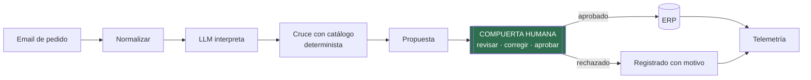

# Agente de pedidos por email — demo

**Llega un pedido por email, una IA lo lee, el catálogo lo resuelve, una persona lo aprueba, y solo entonces entra en el ERP.**

Un workflow de n8n ejecutable, con datos 100% inventados. Replica el patrón de un sistema que
tengo funcionando con un cliente real. El patrón, no el workflow del cliente.

---

## Por qué existe esta demo

Los workflows de mis clientes no se publican, ni siquiera anonimizados: llevan su lógica de
negocio, y esa confidencialidad es parte de lo que pagan. Así que en vez de publicar nada suyo,
reconstruí el patrón desde cero con una empresa ficticia.

**Cerámicas Ejemplo SL no existe.** Ni sus clientes, ni su catálogo, ni estos emails. Lo que sí
es real son las decisiones de diseño: dónde se le permite decidir al LLM, dónde no, dónde va la
compuerta humana y qué se mide.

---

## Qué hace

1. Entra un email de pedido (en la demo lo pegas en un formulario; en producción cuelga de un buzón).
2. Se normaliza el texto: fuera firmas y avisos legales, dentro los hilos citados (las confirmaciones reales suelen estar dos respuestas más abajo).
3. Un LLM (un modelo de lenguaje, la IA que lee el texto) extrae el pedido estructurado: cliente, líneas, cantidades, unidades, notas de entrega. Corre con protecciones para que un email malicioso no pueda darle órdenes al sistema (el detalle técnico está en [`docs/architecture.md`](docs/architecture.md)).
4. **Código determinista** cruza cada línea con el catálogo: primero referencia exacta, después puntuación por descripción. El LLM nunca elige el producto.
5. Cada línea queda etiquetada `alta` / `dudosa` / `no encontrada`. Las dudosas llevan sus productos candidatos.
6. Se monta la propuesta con precios y avisos, y se manda a la **compuerta humana**.
7. Aprobado → se escribe en el "ERP". Rechazado o no-es-un-pedido → se registra con el motivo.
8. La telemetría anota líneas resueltas a la primera, correcciones humanas y tiempo de ciclo.

Arquitectura completa y notas de diseño: [`docs/architecture.md`](docs/architecture.md).

---

## La compuerta humana — por qué importa

La compuerta no es una red de seguridad puesta al final. Es el producto.

Un agente de entrada de pedidos que funciona solo es un riesgo: una referencia alucinada manda
el palet equivocado a un cliente. Por eso el diseño reparte el trabajo según lo que hace bien
cada parte: **el LLM lee, el código decide qué producto es, una persona aprueba.** Las líneas
dudosas llegan ya marcadas con sus candidatos, y eso convierte 10 minutos de trabajo manual en
10 segundos de revisión.

Tres de los emails de ejemplo existen justo para enseñar esto:

| Email | Qué demuestra |
|---|---|
| `email-07-referencia-inexistente` | Una referencia que no está en el catálogo → marcada `no encontrada`, nunca "corregida" |
| `email-08-ambiguo` | Una descripción que casa con dos productos → marcada `dudosa` con ambos candidatos; elige la persona |
| `email-12-no-es-pedido` | Una reclamación, no un pedido → el sistema lo dice y no extrae nada |

---

## Resultados reales — el sistema que replica

> ⚠️ *Los porcentajes de acierto salen de la telemetría de cada sistema; el ahorro de tiempo
> se calcula sobre la línea base que declara el propio equipo del cliente para el proceso
> manual. Cada cifra va con el estado exacto de su proyecto: sin redondeos al alza y sin
> llamar "producción" a lo que es un piloto.*

- **Fabricante cerámico (el patrón de esta demo):** más de 1.300 pedidos reales procesados,
  **96% de acierto medido**, **55% de ganancia de tiempo** para el equipo administrativo.
  Estado: piloto avanzado, con el arranque sobre el ERP oficial en curso.
- **Ingeniería de climatización — buzón de dirección:** más de 190 horas ahorradas, contadas
  operación a operación, 98,7% de acierto. Estado: en uso diario en producción.
- **Ingeniería civil y geotécnica — facturas de proveedor:** 323 operaciones, cero errores
  registrados, con conciliación bancaria revisada por una persona antes de contabilizar.
  Estado: en uso diario en producción.

Diagramas antes/después de estos procesos: [`docs/before-after.md`](docs/before-after.md).

---

## Pruébalo

1. Importa [`workflow/email-to-order-demo.json`](workflow/email-to-order-demo.json) en cualquier n8n (autoalojado o cloud).
2. Crea una credencial **Header Auth** (nombre de cabecera `x-api-key`, valor = tu propia clave) y selecciónala en el nodo `LLM: interpret order`. Este repo no incluye credenciales. La llamada es HTTP directo: cambiar a otro modelo de Anthropic es un campo en el nodo `AI config`; cambiar de proveedor exige además adaptar el nodo que monta la petición y el que valida la respuesta a la API de ese proveedor.
3. Abre la URL del formulario del nodo trigger, pega cualquier archivo de [`data/sample-emails/`](data/sample-emails/) y envía.
4. Míralo correr y aprueba o corrige en la compuerta humana.

El catálogo va embebido en el nodo de cruce para que el workflow funcione solo; los CSV de
`data/` son los mismos datos en formato legible.

---

## Los datos

| Archivo | Contenido |
|---|---|
| `data/catalog.csv` | 30 referencias inventadas: azulejo, pavimento porcelánico, piezas especiales, químicos, con formatos, m² por caja y precios |
| `data/customers.csv` | 8 clientes B2B inventados |
| `data/sample-emails/` | 12 emails de fácil a difícil: referencias exactas, solo descripciones, unidades mezcladas, hilos desordenados, inglés, y uno que no es pedido |

Todo inventado para esta demo. Cualquier parecido con una empresa real es casualidad.

---

## Sobre mí

David González Palmero — ingeniero de procesos reconvertido a consultor de automatización con
IA. Construyo sistemas que meten IA dentro de operaciones reales, con una persona donde la
decisión importa, y mido lo que de verdad entregan.

- LinkedIn: [DavidGonzalezPalmero](https://www.linkedin.com/in/DavidGonzalezPalmero)
- Casos: [alquimiadigitalagency.com](https://alquimiadigitalagency.com)

English version: [`README.md`](README.md) · Licencia: MIT
