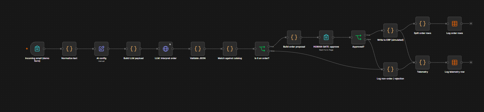
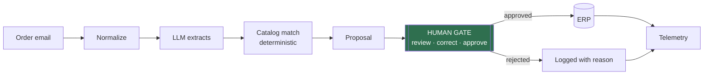
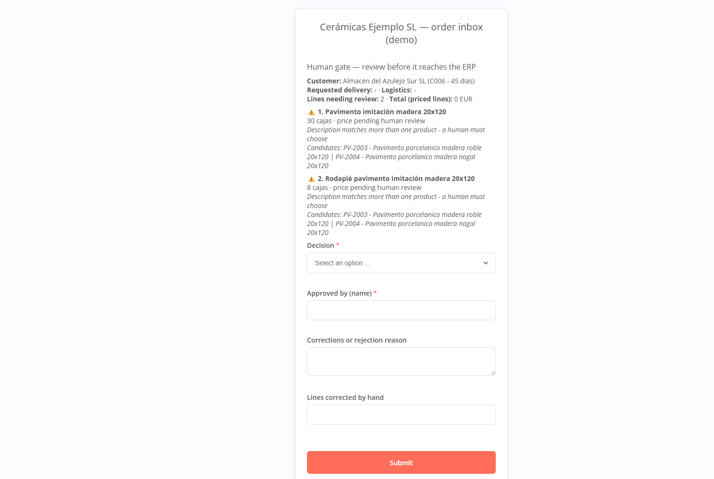

# Email-to-Order AI Agent — demo

**An order email arrives, an AI reads it, the catalog resolves it, a human approves it, and only then does it reach the ERP.**

A runnable n8n workflow with 100% invented data. It replicates the pattern of a system I have
running with a real client. The pattern, not the client's workflow.

---

## Why this demo exists

Client workflows are never published, not even anonymized: they carry the client's business
logic, and that confidentiality is part of what they pay for. So instead of publishing
anything of theirs, I rebuilt the pattern from zero with a fictional company.

**Cerámicas Ejemplo SL does not exist.** Neither do its customers, its catalog or these
emails. What is real are the design decisions: where the LLM is allowed to decide, where it
is not, where the human gate sits, and what gets measured.

---

## What it does

1. An order email comes in (in the demo you paste one into a form; in production it hangs off a mailbox).
2. The text is normalized: signatures and legal footers out, quoted threads kept (real confirmations often live two replies down).
3. An LLM (a large language model, the AI that reads text) extracts a structured order: customer, lines, quantities, units, delivery notes. It runs with guards so a malicious email cannot give the system instructions (technical detail in [`docs/architecture.md`](docs/architecture.md)).
4. **Deterministic code** matches each line against the catalog: exact reference first, then description scoring. The LLM never picks the product.
5. Lines are labelled `high` / `uncertain` / `not_found`. Uncertain lines carry their candidate products.
6. A proposal is built with prices and warnings, and sent to a **human gate**.
7. Approved → written to the "ERP" and logged to a Data Table, one row per order line. Rejected or not-an-order → logged with the reason.
8. Telemetry logs one row per run, approved or not: lines resolved on the first pass, human corrections, cycle time, model and prompt version.

Full architecture and design notes: [`docs/architecture.md`](docs/architecture.md).

---

## The human gate — why it matters

The gate is not a safety net bolted on at the end. It is the product.

An order-entry agent that runs unattended is a liability: one hallucinated reference ships the
wrong pallet to a customer. So the design splits the job by what each part is actually good at:
**the LLM reads, code decides what the product is, a person approves.** Uncertain lines arrive
pre-flagged with their candidates, which turns a 10-minute manual job into a 10-second review.

Three of the sample emails exist specifically to show this:

| Email | What it proves |
|---|---|
| `email-07-referencia-inexistente` | A reference that isn't in the catalog → flagged `not_found`, never auto-corrected |
| `email-08-ambiguo` | A description matching two products → flagged `uncertain` with both candidates, the human picks |
| `email-12-no-es-pedido` | A complaint, not an order → the system says so and extracts nothing |

---

## Real-world results — the system this replicates

> ⚠️ *Accuracy figures come from each system's own telemetry; time savings compare against
> the baseline the client's team reports for the manual process. Every figure is stated with
> the exact status of its project: no rounding up, no "production" where there is a pilot.*

- **Ceramics manufacturer (the pattern in this demo):** 1,300+ real orders processed,
  **96% measured accuracy**, **55% time saving** for the admin team. Status: advanced live
  pilot, final ERP go-live in progress.
- **HVAC engineering — executive mailbox triage:** 190+ hours saved, tracked operation by
  operation, 98.7% accuracy. Status: in daily production.
- **Civil & geotechnical engineering — supplier invoicing:** 323 operations, zero recorded
  errors, with bank reconciliation reviewed by a person before posting. Status: in daily
  production.

Before/after process diagrams for these: [`docs/before-after.md`](docs/before-after.md).

---

## Try it yourself

1. Import [`workflow/email-to-order-demo.json`](workflow/email-to-order-demo.json) into any n8n instance (self-hosted or cloud).
2. Create an **OpenRouter** credential in n8n (native type, just your API key) and select it on the `LLM: interpret order` node. No credentials ship in this repo. The call is plain HTTP and OpenAI-compatible: switching models is one field in `AI config`, and any OpenAI-compatible provider (or a local endpoint) works by changing the endpoint there plus the node's credential.
3. Open the form URL of the trigger node, paste any file from [`data/sample-emails/`](data/sample-emails/), submit.
4. Watch it run, then approve or correct at the human gate.
5. Each run inserts rows into two n8n **Data Tables**: `demo_orders_log` (one row per
   approved order line) and `demo_telemetry_log` (one row per run). Create them once with
   the column names shown in [`results/`](results/) and the two `Log ...` nodes find them by
   name. Works on n8n Cloud and self-hosted alike; no file access needed.
6. Optional but recommended: import [`workflow/error-handler.json`](workflow/error-handler.json),
   point its email node at your SMTP credential, and select it as the Error Workflow in the
   main workflow's settings. A failed run then alerts you instead of dying quietly.

The catalog and the customer table are embedded in the matching node so the workflow runs
standalone; the CSVs in `data/` are the same data in readable form.

---

## What would change in production

The demo keeps the pattern honest but small. Wiring it to a real mailbox would add, in this
order:

- **Deduplication before the LLM**: a hash of message-id + sender, so a redelivered email can
  never become two orders.
- **Catalog and customers from the ERP or database**, not embedded in a node. Here they are
  embedded on purpose so the workflow runs standalone.
- **The error workflow wired to the team's channel** (included in this repo; it needs your
  SMTP or chat credential).
- **Queues and rate limits** on the mailbox trigger, so a burst of emails does not hammer the
  LLM API.
- **Identity from the login (SSO)** instead of a name typed into a form.
- **Raw inbound emails archived on arrival.** In production the mailbox itself is the record;
  in the demo, the n8n execution history keeps each submission.
- **Corrections applied to the stored order.** Today a reviewer's correction is recorded in
  the note and counted in telemetry, but the stored line keeps its unresolved reference (the
  `-` lines in `results/orders-log.csv`). The recorded run also showed the matcher can offer
  only near-misses for a vague line ("su rodapié" drew floor tiles as candidates); the human
  catches it, which is exactly what the gate is for.

---

## The dataset

| File | Contents |
|---|---|
| `data/catalog.csv` | 30 invented references: wall tile, porcelain floor, trims, adhesives, with formats, m² per box and prices |
| `data/customers.csv` | 8 invented B2B customers |
| `data/sample-emails/` | 12 emails, easy to hard: exact references, descriptions only, mixed units, messy threads, English, a non-order |
| `results/` | CSV mirrors of the two Data Tables: one row per approved order line, one telemetry row per run |

All of it invented for this demo. Any resemblance to a real company is coincidental.

The two CSVs in `results/` are the exported log of one full run of the 12 sample emails
(August 2026): 30 order lines, 24 resolved automatically on the first pass, 5 corrected at
the gate, one order rejected over the unknown reference, and the complaint set aside as
not-an-order. The run was driven end to end by Claude, Anthropic's AI assistant, acting as
the order clerk under supervision — which is why `approved_by` reads "Claude (demo run)".

---

## About

David González Palmero — process engineer turned AI automation consultant. I build systems
that put AI inside real operations, with a human where the decision matters, and I measure
what they actually deliver.

- LinkedIn: [DavidGonzalezPalmero](https://www.linkedin.com/in/DavidGonzalezPalmero)
- Case studies: [alquimiadigitalagency.com](https://alquimiadigitalagency.com)

Spanish version of this README: [`README.es.md`](README.es.md) · License: MIT
