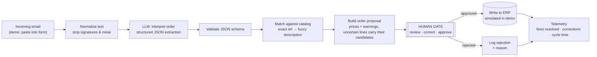

# Architecture — email to approved order

## Design notes

- **The LLM extracts, code matches, a human decides.** The LLM never touches the catalog:
  matching a reference to a product is deterministic code, because an LLM that "helpfully"
  corrects a reference ships the wrong pallet. Uncertain lines are marked and carry their
  candidate products; the system never guesses on the customer's behalf.
- **Every order passes through a person.** Clean or doubtful, nothing reaches the ERP
  without a human approving it. Doubtful lines arrive pre-flagged with candidate matches,
  so the review takes seconds instead of minutes.
- **Guards against malicious emails.** The LLM runs with low reasoning effort, a strict
  JSON schema (structured outputs) and a prompt-injection guard: the email body is wrapped
  as untrusted data and control tags are neutralised before the call, so an email cannot
  give the system instructions. Details in [`prompts/order-interpreter.md`](../prompts/order-interpreter.md).
- **Telemetry on outcomes.** The system logs how many lines were resolved automatically and
  how many the human corrected. That is how the accuracy figure is *measured* rather than
  estimated. In this demo the ERP write is simulated: the node builds the order rows, and
  `results/orders-log.csv` shows the format.
- In the demo, the trigger is an n8n form (paste one of the sample emails and watch it run).
  In production this same flow hangs off a real mailbox trigger; the form makes the demo
  runnable live in interviews with zero credentials.
