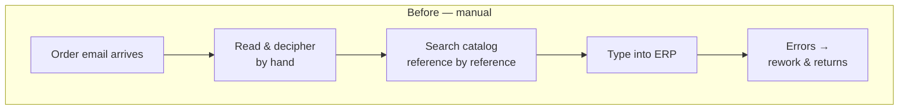
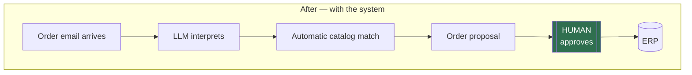
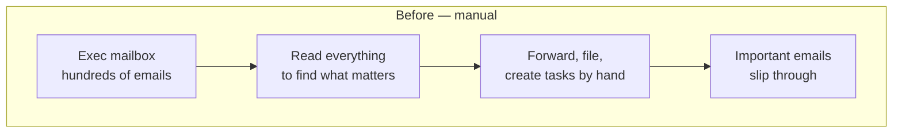
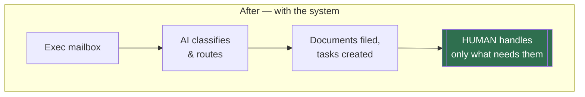

# Before / after — three real processes, same design principle

The person never disappears. They stop typing data and start approving decisions.

> Figures shown are from the real systems these patterns come from, measured by built-in
> telemetry. Client names and internals are never published; the diagrams show the process
> pattern only.

---

## 1. Email orders → ERP (the process this demo replicates)

**Measured:** 1,300+ real orders · 96% measured accuracy · 55% less time — advanced live
pilot, final ERP go-live in progress.

---

## 2. Executive mailbox triage (in daily production)

> ⚠️ Draft — process steps and published figure pending final validation.

**Measured:** 190+ hours saved, tracked operation by operation · 98.7% accuracy — in daily
production.
