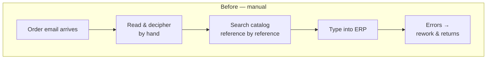
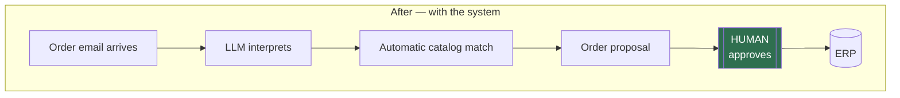
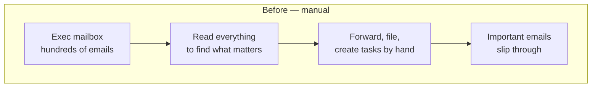
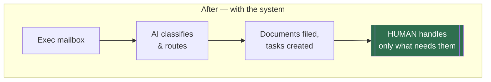
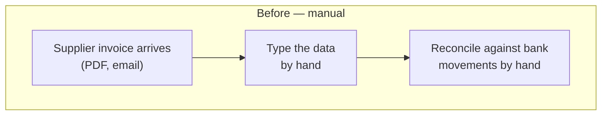
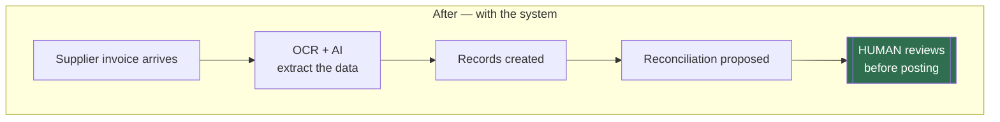

# Before / after — three real processes

The person never disappears from any of them. In orders and invoicing they approve before
anything posts; in the mailbox they handle only what needs their judgement.

> Accuracy figures come from each system's built-in telemetry; time savings compare against
> the baseline the client's team reports for the manual process. Client names and internals
> are never published; the diagrams show the process pattern only.

---

## 1. Email orders → ERP (the process this demo replicates)

**Results:** 1,300+ real orders · 96% accuracy from telemetry · 55% less time vs the
team-reported baseline. Status: advanced live pilot, final ERP go-live in progress.

---

## 2. Executive mailbox triage

**Results:** 190+ hours saved, tracked operation by operation · 98.7% accuracy. Status: in
daily production.

---

## 3. Supplier invoicing (civil & geotechnical engineering)

**Results:** 323 operations · zero recorded errors. Status: in daily production.
